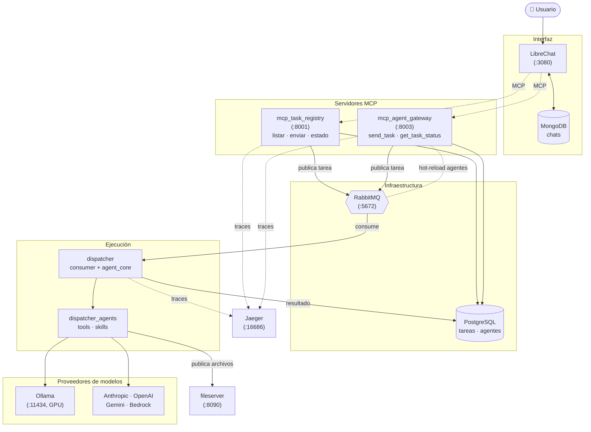

# Sistema multi-agente que integra MCP como puerta de enlace

Este proyecto es una **prueba de concepto** de un sistema de despacho de tareas multi-agente que integra herramientas MCP, agentes con Strands y evaluaciones con DeepEval. **No está diseñado para uso en entornos de producción.**

## Arquitectura

El sistema desacopla la **solicitud** de tareas (vía MCP) de su **ejecución** (vía un dispatcher asíncrono), usando RabbitMQ como cola de mensajes y PostgreSQL como estado compartido. El usuario interactúa por LibreChat, que expone los servidores MCP como herramientas del chat.



**Flujo resumido:** el usuario envía una tarea desde LibreChat → un servidor MCP la registra en PostgreSQL y la publica en RabbitMQ → el `dispatcher` la consume, selecciona el agente (Strands) y modelo correspondiente, ejecuta y guarda el resultado en PostgreSQL → los archivos generados se exponen por el `fileserver`. La telemetría (OpenTelemetry) se envía a Jaeger.

## Paquetes

| Paquete | Descripción |
|---------|-------------|
| `shared/` | Módulos comunes: modelos, base de datos (asyncpg), RabbitMQ (aio-pika), utilidades MCP y telemetría |
| `mcp_task_registry/` | Servidor MCP (puerto 8001) con 4 tools para registro y gestión de tareas |
| `mcp_agent_gateway/` | Servidor MCP (puerto 8003) con 2 tools: `send_task` (enum dinámico de agentes) y `get_task_status`, hot-reload vía RabbitMQ |
| `dispatcher/` | Consumidor de tareas con sub-paquetes: `config/`, `agent_core/` (factory, runner, model resolver) y `pipeline/` (consumer, client) |
| `dispatcher_agents/` | Definiciones de agentes por proveedor (`math`, `redaccion`, `orquestacion`, `gastronomia`) |
| `dispatcher_tools/` | Tools personalizadas por proveedor (`system`, `strands`) |
| `dispatcher_skills/` | Skills con progressive disclosure vía YAML frontmatter en SKILL.md |
| `fileserver/` | Servidor de archivos auxiliar |

## Inicio rápido con Docker Compose

### Variables de entorno

Copiar el archivo de ejemplo y completar los valores requeridos (como mínimo `ANTHROPIC_API_KEY`):

```bash
cp .env.example .env
```

Ver [`.env.example`](.env.example) para la lista completa de variables y sus valores por defecto.

### Requisito de GPU

El servicio **Ollama** está configurado para usar GPU NVIDIA. Esto requiere:
- Una GPU NVIDIA compatible
- [NVIDIA Container Toolkit](https://docs.nvidia.com/datacenter/cloud-native/container-toolkit/install-guide.html) instalado

Si no se dispone de GPU, comentar o eliminar el bloque `deploy.resources.reservations` del servicio `ollama` en `docker-compose.yml`.

### Iniciar el proyecto

```bash
docker compose up -d
```

Esto levanta todos los servicios: PostgreSQL, RabbitMQ, Ollama, Jaeger, los servidores MCP (task registry en puerto 8001 y agent gateway en puerto 8003), el dispatcher, LibreChat, DbGate y el fileserver.

> **Nota sobre volúmenes y empaquetado**
>
> En desarrollo, la configuración del dispatcher **no se copia dentro de la imagen**: se monta desde el host como *bind mounts* en `docker-compose.yml` para permitir hot-reload sin reconstruir:
>
> ```yaml
> volumes:
>   - ./src/dispatcher_agents:/app/agents
>   - ./src/dispatcher_tools:/app/tools
>   - ./src/dispatcher_skills:/app/skills
>   - ./src/models.yml:/app/models.yml
>   - ./mnt/shared-data:/srv/data
>   - ./qa-workspaces:/srv/qa-workspaces
> ```
>
> Por eso esos directorios deben existir en el host (los de datos —`mnt/shared-data`, `qa-workspaces`— los crea Docker automáticamente al levantar).
>
> Si se quiere **empaquetar el sistema en una imagen**  hay que copiar agentes, tools, skills y `models.yml` dentro de la imagen en `src/dispatcher/Dockerfile` y eliminar esos *bind mounts* del `docker-compose.yml`. Por ejemplo:
>
> ```dockerfile
> COPY dispatcher_agents/ /app/agents/
> COPY dispatcher_tools/ /app/tools/
> COPY dispatcher_skills/ /app/skills/
> COPY models.yml /app/models.yml
> ```

Para ver los logs en tiempo real:

```bash
docker compose logs -f
```

Para ver los logs de un servicio específico:

```bash
docker compose logs -f dispatcher
```

### Detener y eliminar el proyecto

Detener los servicios sin eliminar datos:

```bash
docker compose down
```

Detener los servicios y eliminar volúmenes (base de datos, datos de MongoDB, etc.):

```bash
docker compose down -v
```

Detener los servicios, eliminar volúmenes e imágenes construidas:

```bash
docker compose down -v --rmi local
```

## Tests

| Directorio | Tipo | Contenido |
|------------|------|-----------|
| `test/dispatcher/smoke/` | Smoke | Pruebas rápidas de agentes (ej: calculator) |
| `test/dispatcher/evaluations/` | Evaluaciones LLM | Métricas GEval (claridad, correctitud, relevancia), answer relevancy, prompt alignment, tool correctness y red teaming con DeepTeam |
| `test/mcp_agent_gateway/unit/` | Unitarias | Tests de `send_task`, `get_task_status`, `build_agent_enum` y server |
| `test/mcp_agent_gateway/integration/` | Integración | Smoke test del gateway |

Los resultados de la ejecucion de todas las pruebas se encuentran en [`test-result/`](test-result/README.md).

**Comandos para ejecutar las pruebas**

```bash
# MCP Agent Gateway
python -m pytest test/mcp_agent_gateway/integration/ --junitxml=test-result/10-mcp_agent_gateway-integration.xml
python -m pytest test/mcp_agent_gateway/unit/ --junitxml=test-result/11-mcp_agent_gateway-unit.xml

# Dispatcher - Smoke
python -m pytest test/dispatcher/smoke/ --junitxml=test-result/12-dispatcher-smoke.xml

# Evaluaciones de agentes (success y failed)
python -m pytest test/dispatcher/evaluations/test_01-geval_clarity_metric.py --junitxml=test-result/01-dispatcher-geval_clarity_metric-success.xml
python -m pytest test/dispatcher/evaluations/test_01-geval_clarity_metric.py --fail --junitxml=test-result/01-dispatcher-geval_clarity_metric-failed.xml

python -m pytest test/dispatcher/evaluations/test_02-geval_correctness_metric.py --junitxml=test-result/02-dispatcher-geval_correctness_metric-success.xml
python -m pytest test/dispatcher/evaluations/test_02-geval_correctness_metric.py --fail --junitxml=test-result/02-dispatcher-geval_correctness_metric-failed.xml

python -m pytest test/dispatcher/evaluations/test_03-geval_relevance_metric.py --junitxml=test-result/03-dispatcher-geval_relevance_metric-success.xml
python -m pytest test/dispatcher/evaluations/test_03-geval_relevance_metric.py --fail --junitxml=test-result/03-dispatcher-geval_relevance_metric-failed.xml

python -m pytest test/dispatcher/evaluations/test_04-answer_relevancy_metric.py --junitxml=test-result/04-dispatcher-answer_relevancy_metric-success.xml
python -m pytest test/dispatcher/evaluations/test_04-answer_relevancy_metric.py --fail --junitxml=test-result/04-dispatcher-answer_relevancy_metric-failed.xml

python -m pytest test/dispatcher/evaluations/test_05-prompt_alignment_metric.py --junitxml=test-result/05-dispatcher-prompt_alignment_metric-success.xml
python -m pytest test/dispatcher/evaluations/test_05-prompt_alignment_metric.py --fail --junitxml=test-result/05-dispatcher-prompt_alignment_metric-failed.xml

# Evaluacion de tool correctness
python -m pytest test/dispatcher/evaluations/test_06-tool_correctness_metric.py --junitxml=test-result/06-dispatcher-tool_correctness_metric-success.xml
python -m pytest test/dispatcher/evaluations/test_06-tool_correctness_metric.py --fail --junitxml=test-result/06-dispatcher-tool_correctness_metric-failed.xml

# Red teaming
python -m pytest test/dispatcher/evaluations/test_07-red-teaming.py --junitxml=test-result/07-red-teaming.xml
```

### pytest

Fixture @pytest.fixture(scope="module") https://docs.pytest.org/en/stable/reference/reference.html#pytest.fixture 

- function:  x cada prueba (default)
- class: x cada clase de prueba
- module:  x cada archivo de prueba
- package: x cada paquete/directorio de prueba 
- session: x toda la ejecución de pruebas

Mark  @pytest.mark.xfail https://docs.pytest.org/en/stable/example/markers.html 

- skip: la prueba no será ejecutada, ej: prueba en desarrollo, o prueba a ser removida en el futuro
- skipif: la prueba será ejecutada solo si se cumple la condición, ej: SO, variable de entorno, ambiente de prueba
- xfail: se espera que la prueba falle, por lo que su resultado será xpass ej: incidente conocido aún no corregido
- parametrize: define el nombre/posición de los parámetros a inyectar en una función o método de test, y un array con tuplas que poseen los  valores a emplear; una tupla equivaldrá a una ejecución de test. 
- usefixtures: define los fixtures que se requieren para las pruebas de una clase o de un método o función de prueba, ej: remover el contenido del directorio temporal de pruebas

### Variables de fallo intencional

El archivo [`test/dispatcher/conftestfail.py`](test/dispatcher/conftestfail.py) contiene variables deliberadamente incorrectas o desalineadas respecto a los prompts originales de los agentes. Su propósito es estropear los prompts para verificar la sensibilidad de la librería de evaluaciones (DeepEval): al inyectar estos valores, las pruebas deben detectar la degradación y fallar, confirmando que las métricas son capaces de distinguir respuestas correctas de incorrectas.

---

## Aviso importante

> **Este proyecto tiene fines exclusivamente académicos y educativos.** No debe utilizarse en entornos de producción ni para procesar datos reales o sensibles. No se ofrecen garantías de seguridad, disponibilidad ni rendimiento. El uso de este código es bajo la responsabilidad exclusiva del usuario. Los autores no se hacen responsables de daños derivados de su uso fuera del contexto de aprendizaje para el cual fue creado.